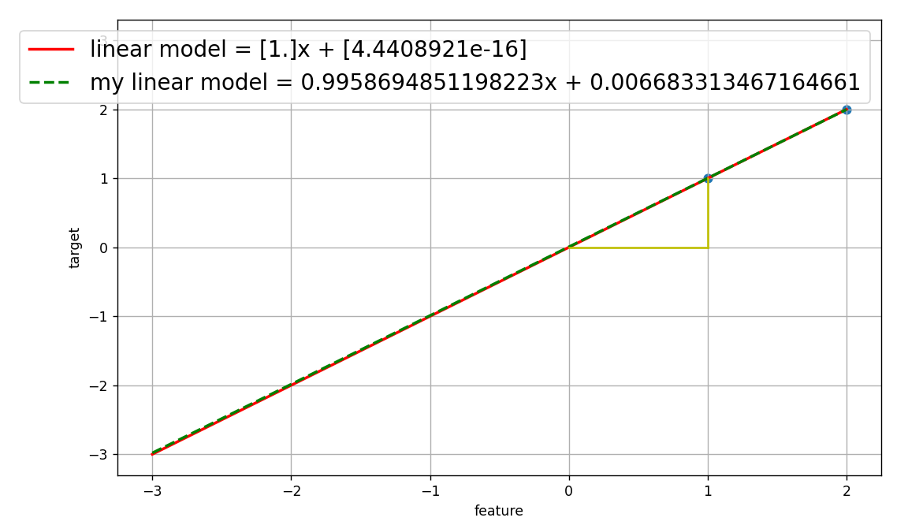
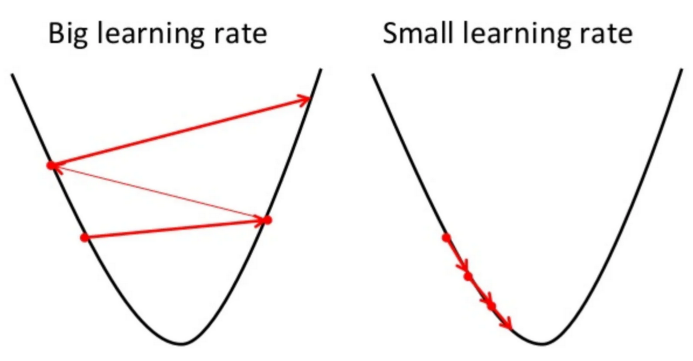

# Machine Learning With C++ : Linear Regression

### Side by side comparison



I'm not going to cover the algorithm itself since it's a basic linear regression. What I really want to highlight is something valuable I learned from implementing the model.

### Learning rate

It turns out that the training speed also depends on the input data amount!

I tested different rates and established a link between the dataset size and the result's accuracy. For example, when I trained the model using the rate of 0.1 using three feature and target values, the resulting coefficients were perfect. However, when I tried a larger dataset, the coefficients were significantly off! Conversely, with a learning rate value of 0.01 and a large number of input features and targets, I got excellent results. But the same learning rate of 0.01 never worked well with the small dataset.

```
double learning_rate = x.size() >= 5 ? 0.01 : 0.1;
```



### Resources

* [Introduction to Machine Learning Algorithms: Linear Regression](https://towardsdatascience.com/introduction-to-machine-learning-algorithms-linear-regression-14c4e325882a)
